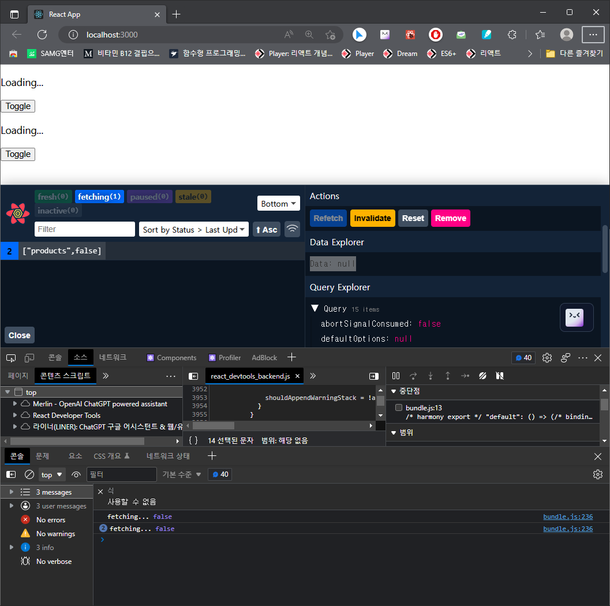

##### ✨ React Query  

###### @tanstack/react-query   


- 사용하는 이유  :  Custom Hook 의 문제로 인해.    1.Cache   2.Retry 기능이 없음.

  React Query 사용하여 이런 문제를 해결..

  

###### INSTALL   

환경설정   yarn 으로 설치한다.

+ @tanstack/react-query 를 설치한다.

  1. yarn create react-app query-init 
     ✨ 디렉토리 상위에서 프로젝트(query-init)를 생성합니다. 
  2. cd query-init ✨   yarn init ✨
  3. yarn add @tanstack/react-query  
     ✨명령으로 react-query를 설치 해줍니다. 
  4. yarn add @tanstack/react-query-devtools  
     ✨명령으로 react-query-devtools를 설치 해줍니다. 
  5. yarn start 하면 페이지가 열립니다...
     

공식문서 : tanstack.com   ReactQuery
https://tanstack.com/query/latest/docs/react/installation

API :  
https://tanstack.com/query/latest/docs/react/reference/useQuery


```react
import { useQuery } from '@tanstack/react-query';
```

------

######  SOURCE


✨ src/components/Product.jsx
<details>
<summary>접기/펼치기</summary>
<div markdown="1">

```react
import React, { useState } from 'react';
import { useQuery } from '@tanstack/react-query';

export default function Products() {
  const [checked, setChecked] = useState(false);
  // const [isLoading, error, products] = useProducts({ salesOnly: checked });
  const handleChange = () => setChecked((prev) => !prev);

  const {
    isLoading,
    error,
    data: products, //여기서 data를 인식 못하고 값이 넘어가지 않음.
  } = useQuery(['products', checked], async () => {
    console.log('fetching...', checked);
    return fetch(`data/${checked ? 'sale_' : ''}products.json`.then((res) => res.json()
    ));
  },
  {
    staleTime: 1000 * 60 * 5,
  }
);
    
  if (isLoading) return <p>Loading...</p>;

  if (error) return <p>{error}</p>;

  return (
    <>
      <input
        id='checkbox'
        type='checkbox'
        value={checked}
        onChange={handleChange}
      />
      <label htmlFor='checkbox'> Show Only 🔥 Sale</label>
      <ul>
        {products.map((product) => (
          <li key={product.id}>
            <article>
              <h3>{product.name}</h3>
              <p>{product.price}</p>
            </article>
          </li>
        ))}
      </ul>
    </>
  );
}

```
</div>
</details>


✨ App.js
<details>
<summary>접기/펼치기</summary>
<div markdown="1">
```react
import React from 'react';
import './App.css';
import MainProducts from './components/MainProducts';
import {
  QueryClient,
  QueryClientProvider
} from '@tanstack/react-query';
import { ReactQueryDevtools } from '@tanstack/react-query-devtools';

const queryClient = new QueryClient(); //예제에서 복사

export default function App() {
  return (
    <QueryClientProvider client={queryClient}>
      <MainProducts />
      <ReactQueryDevtools initialIsOpen={true} />
    </QueryClientProvider>
  );
}
```
</div>
</details>


✨ src/hooks/use-project.jsx

<details>
<summary>접기/펼치기</summary>
<div markdown="1">
```react
import { useEffect, useState } from 'react';

export default function useProducts({ salesOnly }) {
  const [loading, setLoading] = useState(false);
  const [error, setError] = useState();
  const [products, setProducts] = useState([]);
  useEffect(() => {
    console.log('1 fetching....');
    setLoading(true);
    setError(undefined);
    fetch(`data/${salesOnly ? 'sale_' : ''}products.json`)
      .then((res) => res.json())
      .then((data) => {
        console.log('🔥뜨끈한 데이터 네트워크에서 받아옴');
        setProducts(data);
      })
      .catch((e) => setError('에러가 발생 !'))
      .finally(() => setLoading(false));
    return () => {
      console.log('🧹 깨끗하게 청소');
    };
  }, [salesOnly]);

  return [loading, error, products];
}

```
</div>
</details>


✨ src/components/MainProducts.jsx

<details>
<summary>접기/펼치기</summary>
<div markdown="1">
```react
import React, { useState } from 'react';
import Products from './Products';

export default function MainProducts() {
  const [showLeftProducts, setShowLeftProducts] = useState(true);
  const [showRightProducts, setShowRightProducts] = useState(true);
  return (
    <main className='container'>
      <div>
        {showLeftProducts && <Products />}
        <button onClick={() => setShowLeftProducts((show) => !show)}>
          Toggle
        </button>
      </div>
      <div>
        {showRightProducts && <Products />}
        <button onClick={() => setShowRightProducts((show) => !show)}>
          Toggle
        </button>
      </div>
    </main>
  );
}
```
</div>
</details>


###### ERROR

```bash
react_devtools_backend.js:4012 
        
TypeError: (intermediate value)(intermediate value)(intermediate value).then is not a function
    at Products.staleTime [as queryFn] (bundle.js:237:64)
    at Object.fetchFn [as fn] (bundle.js:43688:27)
    at run (bundle.js:44940:31)
    at bundle.js:44975:11
overrideMethod @ react_devtools_backend.js:4012
        
Uncaught Error: Objects are not valid as a React child (found: [object Error]). If you meant to render a collection of children, use an array instead.
    at throwOnInvalidObjectType (bundle.js:20230:13)
    at reconcileChildFibers (bundle.js:21006:11)
    at reconcileChildren (bundle.js:23940:32)
    at updateHostComponent (bundle.js:24577:7)
    at beginWork (bundle.js:26022:18)
    at HTMLUnknownElement.callCallback (bundle.js:11008:18)
    at Object.invokeGuardedCallbackDev (bundle.js:11052:20)
    at invokeGuardedCallback (bundle.js:11109:35)
    at beginWork$1 (bundle.js:30983:11)
    at performUnitOfWork (bundle.js:30230:16)

        
       Uncaught Error: Objects are not valid as a React child (found: [object Error]). If you meant to render a collection of children, use an array instead.
    at throwOnInvalidObjectType (bundle.js:20230:13)
    at reconcileChildFibers (bundle.js:21006:11)
    at reconcileChildren (bundle.js:23940:32)
    at updateHostComponent (bundle.js:24577:7)
    at beginWork (bundle.js:26022:18)
    at HTMLUnknownElement.callCallback (bundle.js:11008:18)
    at Object.invokeGuardedCallbackDev (bundle.js:11052:20)
    at invokeGuardedCallback (bundle.js:11109:35)
    at beginWork$1 (bundle.js:30983:11)
    at performUnitOfWork (bundle.js:30230:16)

        
The above error occurred in the <p> component:
    at p
    at Products (http://localhost:3000/static/js/bundle.js:227:80)
    at div
    at main
    at MainProducts (http://localhost:3000/static/js/bundle.js:117:98)
    at QueryClientProvider (http://localhost:3000/static/js/bundle.js:47107:5)
    at App

Uncaught Error: Objects are not valid as a React child (found: [object Error]). If you meant to render a collection of children, use an array instead.
    at throwOnInvalidObjectType (bundle.js:20230:13)
    at reconcileChildFibers (bundle.js:21006:11)
    at reconcileChildren (bundle.js:23940:32)
    at updateHostComponent (bundle.js:24577:7)
    at beginWork (bundle.js:26022:18)
    at beginWork$1 (bundle.js:30961:18)
    at performUnitOfWork (bundle.js:30230:16)
    at workLoopSync (bundle.js:30153:9)
    at renderRootSync (bundle.js:30126:11)
    at recoverFromConcurrentError (bundle.js:29618:24)
```

위와 같이 화면로딩후 넘겨야할 data에 아무런 값이 없고 "Uncaught Error: Objects are not valid as a React child (found: [object Error]). If you meant to render a collection of children, use an array instead." 에러가 난다.

해결을 위해 공식문서에 API가 변경 됬는지 확인해봐야 하는 작업이 필요할 거 같은데.
2일쨰 확인이 안되고 있다.
API : [useQuery | TanStack Query Docs](https://tanstack.com/query/latest/docs/react/reference/useQuery)
GUIDE : [Queries | TanStack Query Docs](https://tanstack.com/query/latest/docs/react/guides/queries)

```react
function Todos() {
  const { isLoading, isError, data, error } = useQuery({
    queryKey: ['todos'],
    queryFn: fetchTodoList,
  }) 
  .....
function Todos() {
  const { status, data, error } = useQuery({
    queryKey: ['todos'],
    queryFn: fetchTodoList,
  })
  ....
So keep in mind that a query can be in state without actually fetching data. As a rule of thumb:loading

The gives information about the : Do we have any or not?statusdata
The gives information about the : Is it running or not?fetchStatusqueryFn
Further Reading
For an alternative way of performing status checks, have a look at the Community Resources.
```

가이드대로 위와 같이 변경 된듯 합니다. data 를 쓰지 않고 queryKey 로 사용하라는건지 ...
근래 바뀐듯 합니다. 커뮤니티를 가보라고 쓰여 있으니 더 뒤져 봐야 할거 같은데요.

커뮤니티 : [쿼리 데이터 변환 반응 | TkDodo의 블로그](https://tkdodo.eu/blog/react-query-data-transformations)

............................................................. ;)
에러 화면 :



여기까지... 좀 자야 겠어요 zzzzzzzzz
