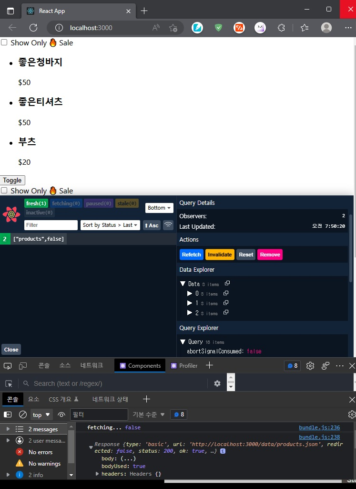

##### ✨ React Query  

###### @tanstack/react-query   


- React-Query 사용하는 이유  :  Custom Hook 의 문제로 인해.    1.Cache   2.Retry 기능이 없음.

  React Query 사용하여 이런 문제를 해결..

  

###### INSTALL   

환경설정   yarn 으로 설치한다.

+ @tanstack/react-query 를 설치한다.

  1. yarn create react-app query-init 
     ✨ 디렉토리 상위에서 프로젝트(query-init)를 생성합니다. 
  2. cd query-init ✨   yarn init ✨
  3. yarn add @tanstack/react-query  
     ✨명령으로 react-query를 설치 해줍니다. 
  4. yarn add @tanstack/react-query-devtools  
     ✨명령으로 react-query-devtools를 설치 해줍니다. 
  5. yarn start 하면 페이지가 열립니다...
     

공식문서 : tanstack.com   ReactQuery
https://tanstack.com/query/latest/docs/react/installation

API :  
https://tanstack.com/query/latest/docs/react/reference/useQuery


```react
import { useQuery } from '@tanstack/react-query';
```

------

######  SOURCE


✨ src/components/Product.jsx
<details>
<summary>Product.jsx</summary>
<div markdown="1">

```react
import React, { useState } from 'react';
import { useQuery } from '@tanstack/react-query';

export default function Products() {
  const [checked, setChecked] = useState(false);
  // const [isLoading, error, products] = useProducts({ salesOnly: checked });
  const handleChange = () => setChecked((prev) => !prev);

  const {
    isLoading,
    error,
    data: products, //여기서 data를 인식 못하고 값이 넘어가지 않음.
  } = useQuery(['products', checked], async () => {
    console.log('fetching...', checked);
    return fetch(`data/${checked ? 'sale_' : ''}products.json`.then((res) => res.json()
    ));
  },
  {
    staleTime: 1000 * 60 * 5,
  }
);
    
  if (isLoading) return <p>Loading...</p>;

  if (error) return <p>{error}</p>;

  return (
    <>
      <input
        id='checkbox'
        type='checkbox'
        value={checked}
        onChange={handleChange}
      />
      <label htmlFor='checkbox'> Show Only 🔥 Sale</label>
      <ul>
        {products.map((product) => (
          <li key={product.id}>
            <article>
              <h3>{product.name}</h3>
              <p>{product.price}</p>
            </article>
          </li>
        ))}
      </ul>
    </>
  );
}

```
</div>
</details>


###### ERROR

```bash
react_devtools_backend.js:4012 
        
TypeError: (intermediate value)(intermediate value)(intermediate value).then is not a function

Uncaught Error: Objects are not valid as a React child (found: [object Error]). If you meant to render a collection of children, use an array instead.

Uncaught Error: Objects are not valid as a React child (found: [object Error]). If you meant to render a collection of children, use an array instead.

The above error occurred in the <p> component:

Uncaught Error: Objects are not valid as a React child (found: [object Error]). If you meant to render a collection of children, use an array instead.

```

위와 같이 화면로딩후 넘겨야할 data에 아무런 값이 없고 "Uncaught Error: Objects are not valid as a React child (found: [object Error]). If you meant to render a collection of children, use an array instead." 에러가 난다.

해결을 위해 공식문서에 API가 변경 됬는지 확인해봐야 하는 작업이 필요할 거 같은데.

2일쨰 확인이 안되고 있다. -_- ;;;;;;;

API : [useQuery | TanStack Query Docs](https://tanstack.com/query/latest/docs/react/reference/useQuery)
GUIDE : [Queries | TanStack Query Docs](https://tanstack.com/query/latest/docs/react/guides/queries)

```react
function Todos() {
  const { isLoading, isError, data, error } = useQuery({
    queryKey: ['todos'],
    queryFn: fetchTodoList,
  }) 
  .....
function Todos() {
  const { status, data, error } = useQuery({
    queryKey: ['todos'],
    queryFn: fetchTodoList,
  })
  ....
So keep in mind that a query can be in state without actually fetching data. As a rule of thumb:loading

The gives information about the : Do we have any or not?statusdata
The gives information about the : Is it running or not?fetchStatusqueryFn
Further Reading
For an alternative way of performing status checks, have a look at the Community Resources.
```

가이드대로 위와 같이 변경 된듯 합니다. data 를 쓰지 않고 queryKey 로 사용하라는건지 ...


```react
const query = useQuery({ queryKey: ['todos'], queryFn: fetchTodos })
```

근래 바뀐듯 합니다. 커뮤니티를 가보라고 쓰여 있으니 더 뒤져 봐야 할거 같은데요.

**커뮤니티 **: [TkDodo의 블로그](https://tkdodo.eu/blog/react-query-data-transformations)


에러 화면 :

해결 :  react-query v3로 다운그레이드 해서 정상 동작 되었다. ;)


`yarn remove @tanstack/react-query`

after

`npm i react-query@3`

정상화면 : )


